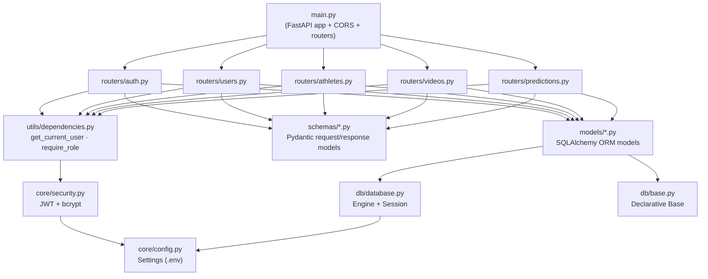

# Backend Architecture

## Request lifecycle (example: `GET /athletes/me`)
1. Request hits `routers/athletes.py`
2. FastAPI resolves the `get_current_user` dependency, which decodes the JWT
   via `core/security.py` and loads the `User` row via SQLAlchemy
3. The route queries `Athlete` filtered by `user_id`
4. The ORM object is serialized through the `AthleteOut` Pydantic schema
5. FastAPI returns JSON to the client
