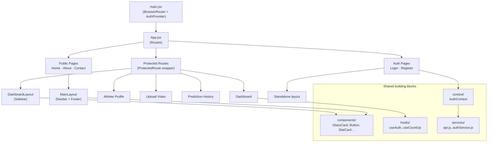

# Frontend Architecture

## Folder responsibilities
- **`layouts/`** — page chrome shared across groups of pages (public site vs. authenticated dashboard)
- **`components/`** — small, reusable, presentation-focused pieces
- **`pages/`** — one file per route, composes layouts + components
- **`context/` + `hooks/`** — global auth state and reusable stateful logic
- **`services/`** — all HTTP calls, isolated from components so the API layer can change independently of the UI
