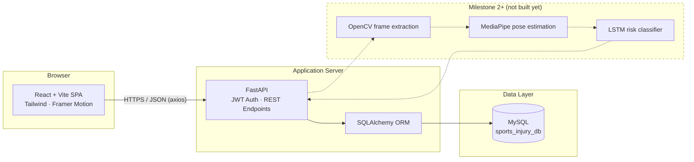

# System Architecture

## Layer responsibilities

| Layer | Responsibility | Milestone 1 status |
|---|---|---|
| Client | Rendering, routing, client-side validation, token storage | ✅ Complete |
| Application Server | Auth, request validation, business rules | ✅ Foundation complete |
| Data Layer | Persistent storage of users, athletes, videos, predictions | ✅ Schema complete |
| AI Pipeline | Frame extraction → pose estimation → risk classification | ⏳ Milestone 2–4 |
