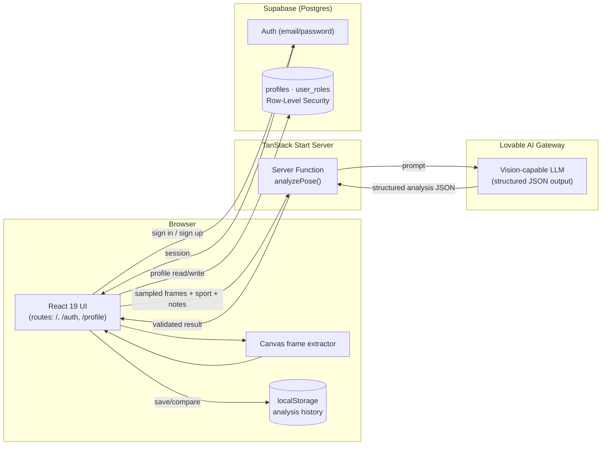

# System Architecture

## Why this shape?
- **No video ever hits a server or database** — frames are sampled and
  downscaled entirely in the browser via `<canvas>`, keeping the app
  free of video storage/streaming infrastructure.
- **Auth and profile data live in Supabase**, protected by Row-Level
  Security, so a user can only ever read/write their own profile (with a
  narrow, function-gated exception for coaches).
- **Analysis is stateless and on-demand** — the server function is a thin
  validation + prompting layer between the browser and the AI gateway; it
  doesn't persist anything itself. History lives client-side.
