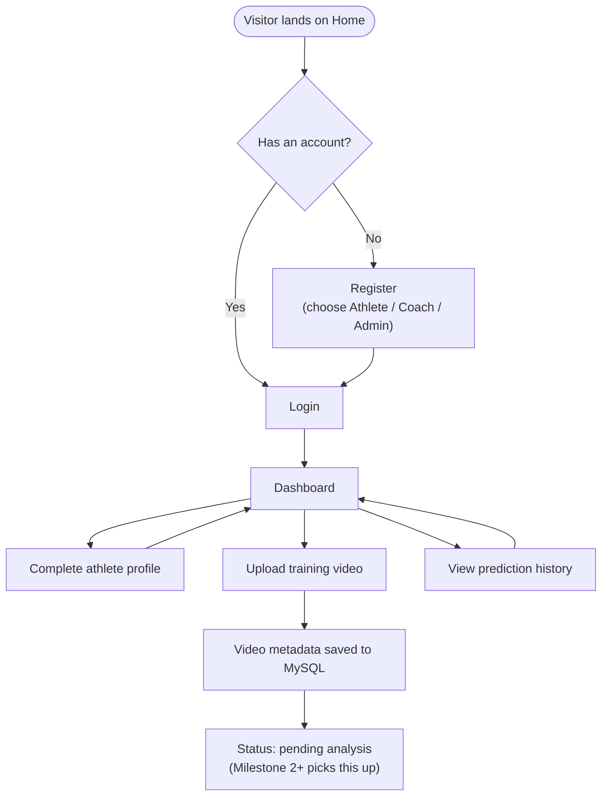
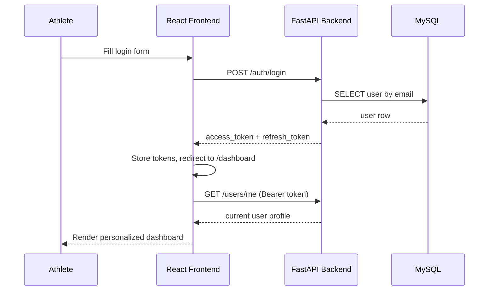

# User Flow Diagram

```mermaid
flowchart TD
    Start(["Visitor lands on Home"]) --> Choice{"Has an account?"}
    Choice -- No --> Register["Register<br/>(choose Athlete / Coach / Admin)"]
    Choice -- Yes --> Login["Login"]

    Register --> Login
    Login --> Dashboard["Dashboard"]

    Dashboard --> Profile["Complete athlete profile"]
    Dashboard --> Upload["Upload training video"]
    Dashboard --> History["View prediction history"]

    Upload --> Registered["Video metadata saved to MySQL"]
    Registered --> Pending["Status: pending analysis<br/>(Milestone 2+ picks this up)"]

    Profile --> Dashboard
    History --> Dashboard
```

## Workflow diagram (session-level)

```mermaid
sequenceDiagram
    participant U as Athlete
    participant FE as React Frontend
    participant API as FastAPI Backend
    participant DB as MySQL

    U->>FE: Fill login form
    FE->>API: POST /auth/login
    API->>DB: SELECT user by email
    DB-->>API: user row
    API-->>FE: access_token + refresh_token
    FE->>FE: Store tokens, redirect to /dashboard
    FE->>API: GET /users/me (Bearer token)
    API-->>FE: current user profile
    FE-->>U: Render personalized dashboard
```
