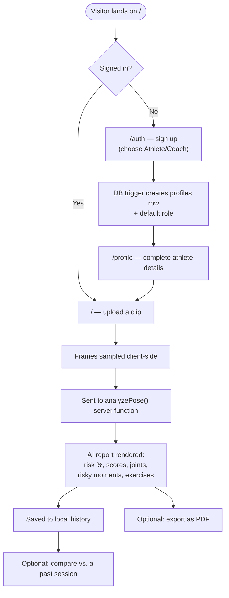
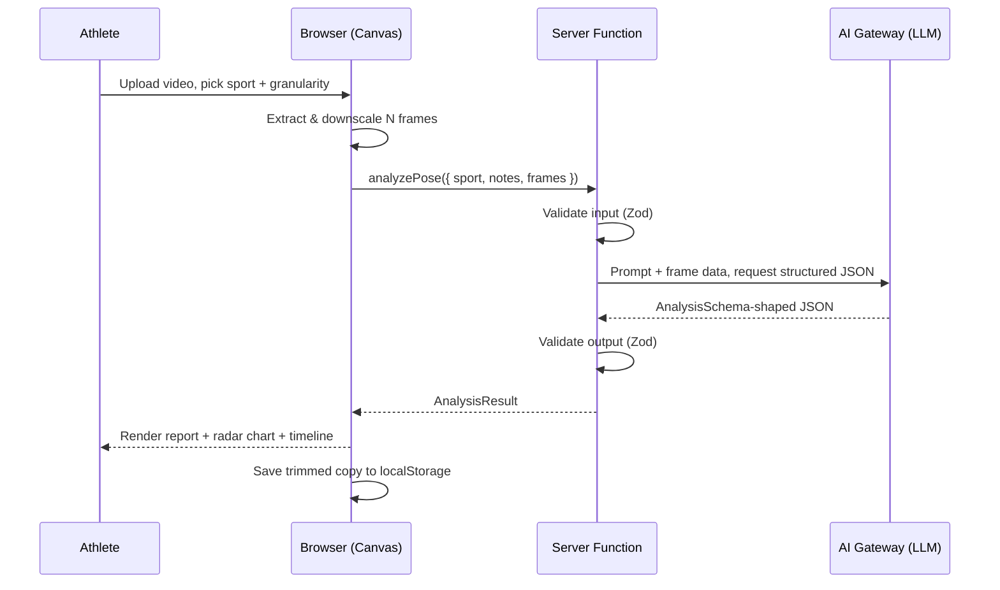

# User Flow

```mermaid
flowchart TD
    Start(["Visitor lands on /"]) --> HasAccount{"Signed in?"}
    HasAccount -- No --> Auth["/auth — sign up<br/>(choose Athlete/Coach)"]
    HasAccount -- Yes --> Analyze

    Auth --> Trigger["DB trigger creates profiles row<br/>+ default role"]
    Trigger --> Profile["/profile — complete athlete details"]
    Profile --> Analyze["/ — upload a clip"]

    Analyze --> Extract["Frames sampled client-side"]
    Extract --> Send["Sent to analyzePose() server function"]
    Send --> AIReport["AI report rendered:<br/>risk %, scores, joints,<br/>risky moments, exercises"]

    AIReport --> SaveHistory["Saved to local history"]
    AIReport --> ExportPDF["Optional: export as PDF"]
    SaveHistory --> Compare["Optional: compare vs. a past session"]
```

## Sequence — one analysis run

```mermaid
sequenceDiagram
    participant U as Athlete
    participant B as Browser (Canvas)
    participant SFN as Server Function
    participant AI as AI Gateway (LLM)

    U->>B: Upload video, pick sport + granularity
    B->>B: Extract & downscale N frames
    B->>SFN: analyzePose({ sport, notes, frames })
    SFN->>SFN: Validate input (Zod)
    SFN->>AI: Prompt + frame data, request structured JSON
    AI-->>SFN: AnalysisSchema-shaped JSON
    SFN->>SFN: Validate output (Zod)
    SFN-->>B: AnalysisResult
    B-->>U: Render report + radar chart + timeline
    B->>B: Save trimmed copy to localStorage
```
