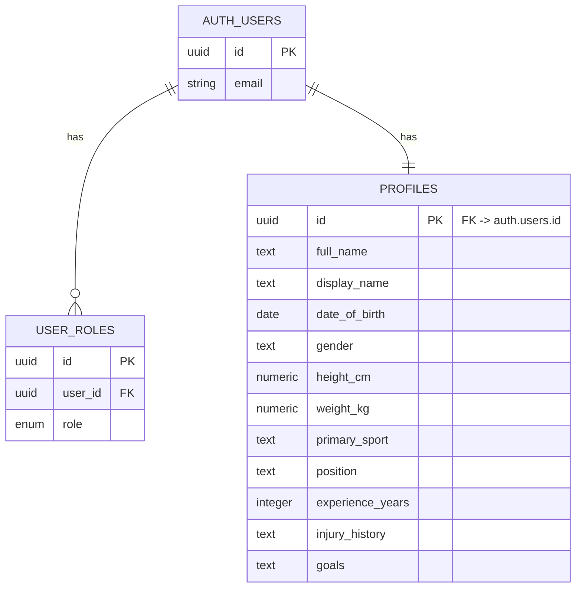

# Database — Supabase (Postgres)

The schema is managed as SQL migrations in
[`../supabase/migrations/`](../supabase/migrations/) — that's the source of
truth. This file documents what those migrations create and why.

## Tables

### `public.user_roles`
| Column | Type | Notes |
|---|---|---|
| `id` | UUID (PK) | |
| `user_id` | UUID (FK → `auth.users.id`) | cascade delete |
| `role` | enum `app_role` (`athlete` \| `coach` \| `admin`) | |
| `created_at` | timestamptz | |

Unique constraint on `(user_id, role)` — a user can hold multiple roles but not duplicate the same one.

### `public.profiles`
| Column | Type | Notes |
|---|---|---|
| `id` | UUID (PK, FK → `auth.users.id`) | 1:1 with the auth user |
| `full_name`, `display_name` | text | |
| `date_of_birth` | date | |
| `gender` | text | |
| `height_cm`, `weight_kg` | numeric(5,1) | |
| `dominant_side` | text | |
| `primary_sport`, `position` | text | |
| `experience_years` | integer | |
| `training_frequency` | text | |
| `injury_history`, `goals` | text | |
| `avatar_url` | text | |
| `created_at`, `updated_at` | timestamptz | `updated_at` auto-maintained by trigger |

## Row-Level Security (RLS)

Both tables have RLS **enabled**. Key policies:
- Users can only `SELECT` their own row in `user_roles`.
- Users can `SELECT` / `INSERT` / `UPDATE` their own `profiles` row (`auth.uid() = id`).
- Users with the `coach` role can `SELECT` **all** profiles, via the
  `has_role()` `SECURITY DEFINER` function — this avoids a recursive RLS
  policy (a policy on `profiles` can't safely query `profiles` itself to
  check role, so the role check is a separate function against `user_roles`).

## Automation

- **`handle_new_user()`** — trigger on `auth.users` insert. Creates a
  `profiles` row and a default `athlete` role (or whatever role was passed
  in the sign-up form's metadata) automatically, so the app never has to
  manually provision these rows after sign-up.
- **`tg_set_updated_at()`** — trigger that stamps `profiles.updated_at` on every update.

## ER diagram

## What's intentionally *not* in this schema
Video files and AI analysis results are **not** persisted server-side in
this version — analyses are computed on demand and cached in the browser's
`localStorage` (see `src/lib/history.ts`, capped at 12 entries). See
[`../docs/AI_ANALYSIS.md`](../docs/AI_ANALYSIS.md) for how to add a
server-side `analyses` table if you want cross-device history or coach
visibility into an athlete's analysis history.
