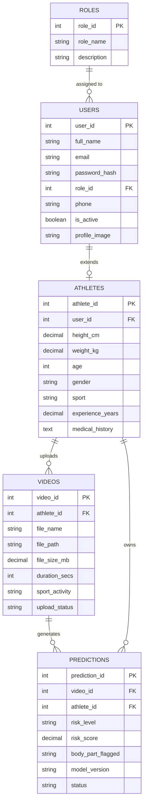

# Entity Relationship Diagram — Milestone 1

Rendered with [Mermaid](https://mermaid.js.org/) — view directly on GitHub or in VS Code with the Mermaid preview extension.

## Relationship summary

| Relationship | Type | Notes |
|---|---|---|
| Roles → Users | 1 : N | A role can be assigned to many users |
| Users → Athletes | 1 : 1 | Only users with the `athlete` role get a row here |
| Athletes → Videos | 1 : N | An athlete can upload many videos |
| Videos → Predictions | 1 : N | Milestone 1 models 1 video → many predictions (supports re-runs in later milestones) |
| Athletes → Predictions | 1 : N | Denormalized FK kept on predictions for fast per-athlete history queries |

## Normalization notes
- **1NF**: every column holds a single atomic value (no comma-separated lists).
- **2NF**: every non-key column depends on the whole primary key — trivial here since all tables use single-column surrogate keys.
- **3NF**: no transitive dependencies, e.g. `role_name` lives only in `roles`, not repeated on every `users` row.
